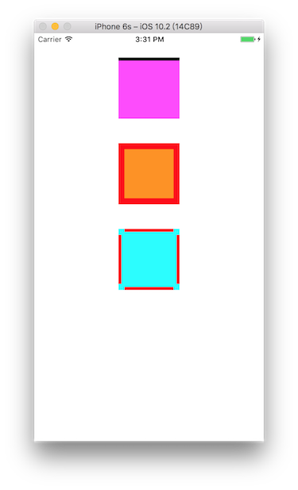

# ViewBorders

[](https://travis-ci.org/mzeng/ViewBorders)
[](http://cocoapods.org/pods/ViewBorders)
[](http://cocoapods.org/pods/ViewBorders)
[](http://cocoapods.org/pods/ViewBorders)

##Introduce
add border to view

## Example
```Objective-C
[self.firstView zm_addAutolayoutBorder:UIRectEdgeTop color:[UIColor blackColor] thickness:10];
[self.secondView zm_addAutolayoutBorder:UIRectEdgeAll color:[UIColor redColor] logicThickness:10];
[self.thirdView zm_addAutolayoutBorder:UIRectEdgeAll color:[UIColor redColor] thickness:5 inset:10];
```

To run the example project, clone the repo, and run `pod install` from the Example directory first.

## Requirements

## Installation

ViewBorders is available through [CocoaPods](http://cocoapods.org). To install
it, simply add the following line to your Podfile:

```ruby
pod "ViewBorders", :git => 'https://github.com/mailworks/ViewBorders'
```

## Author

mzeng, mailworks@qq.com

## License

ViewBorders is available under the MIT license. See the LICENSE file for more info.
